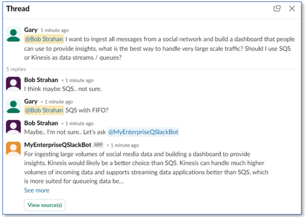

# Slack gateway for for Amazon Q Business

| :zap: If you created a new Amazon Q Business application on or after April 30th, 2024, you can now set up a Slack gateway using the updated instructions provided below. Please note that the Microsoft Teams gateway is not supported for these new applications. These new Amazon Q Business applications are integrated with IAM Identity Center. The CloudFormation (CFN) template and the necessary steps have been updated to accommodate the setup of the Slack gateway for new applications.
|-----------------------------------------|

**Note:** The instructions provided in this guide are specific to Okta, but they should also work for other OIDC 2.0 compliant Identity Providers (IdPs) with minor adjustments.

Amazon Q is a new generative AI-powered application that helps users get work done. Amazon Q can become your tailored business expert and let you discover content, brainstorm ideas, or create summaries using your company’s data safely and securely. For more information see: [Introducing Amazon Q, a new generative AI-powered assistant (preview)](https://aws.amazon.com/blogs/aws/introducing-amazon-q-a-new-generative-ai-powered-assistant-preview)

In this repo we share a project which lets you use Amazon Q's generative AI to enable Slack channel members  to access your organizations data and knowledge sources via conversational question-answering. You can connect to your organization data via data source connectors and integrate it with Slack Gateway for Amazon Q to enable access to your Slack channel members. It allows your users to:
- Converse with Amazon Q using Slack Direct Message (DM) to ask questions and get answers based on company data, get help creating new content such as emails, and performing tasks. 
- You can also invite it to participate in your team channels. 
  - In a channel users can ask it questions in a new message, or tag it in a thread at any point. Get it to provide additional data points, resolve a debate, or summarize the conversation and capture next steps. 

It's amazingly powerful. Here's a demo - seeing is believing!
 

https://github.com/aws-samples/amazon-q-slack-gateway/assets/10953374/6902a9ea-7a24-4e00-bd41-e1029d0f58e4


It's easy to deploy in your own AWS Account, and add to your own Slack Workspace. We show you how below.

### Features
- In DMs it responds to all messages
- In channels it responds only to @mentions, and always replies in thread
- Renders answers containing markdown - e.g. headings, lists, bold, italics, tables, etc. 
- Provides thumbs up / down buttons to track user sentiment and help improve performance over time
- Provides Source Attribution - see references to sources used by Amazon Q
- Aware of conversation context - it tracks the conversation and applies context
- Aware of multiple users - when it's tagged in a thread, it knows who said what, and when - so it can contribute in context and accurately summarize the thread when asked.  
- Process up to 5 attached files for document question answering, summaries, etc.
- Reset and start new conversation in DM channel by using `/new_conversation`

This sample Amazon Q slack application is provided as open source — use it as a starting point for your own solution, and help us make it better by contributing back fixes and features via GitHub pull requests. Explore the code, choose Watch to be notified of new releases, and check back for the latest  updates.



Follow the instructions below to deploy the project to your own AWS account and Slack workspace, and start experimenting!

## Deploy the solution

### Prerequisites

1. You need to have an AWS account and an IAM Role/User with permissions to create and manage the necessary resources and components for this application. *(If you do not have an AWS account, please see [How do I create and activate a new Amazon Web Services account?](https://aws.amazon.com/premiumsupport/knowledge-center/create-and-activate-aws-account/))*

2. You need to have an Okta Workforce Identity Cloud account. If you haven't signed up yet, see [Signing up for Okta](https://www.okta.com/)

3. You need to configure SAML and SCIM with Okta and IAM Identity Center. If you haven't configured, see [Configuring SAML and SCIM with Okta and IAM Identity Center](https://docs.aws.amazon.com/singlesignon/latest/userguide/gs-okta.html)

4. You also need to have an existing, working Amazon Q business application integrated with IdC. If you haven't set one up yet, see [Creating an Amazon Q application](https://docs.aws.amazon.com/amazonq/latest/business-use-dg/create-app.html)

5. You need to have users subscribed to your Amazon Q business application, and are able to access Amazon Q Web Experience. If you haven't set one up yet, see [Subscribing users to an Amazon Q application](https://docs.aws.amazon.com/amazonq/latest/qbusiness-ug/adding-users-groups.html)

6. You have aws cli latest version installed on your Linux or MacOS system. If you haven't installed yet, see [Installing the AWS CLI version 2](https://docs.aws.amazon.com/cli/latest/userguide/install-cliv2.html)


### 1. Setup

#### 1.1 Create an OIDC app integration, for the gateway, in Okta.

Create the client as a ['Web app'](https://help.okta.com/en-us/content/topics/apps/apps_app_integration_wizard_oidc.htm). You will want to enable the 'Refresh Token' grant type, 'Allow everyone in your organization to access', and 'Federation Broker Mode'. Use a placeholder URL, like ```https://example.com```, for the redirect URI, as you will update this later (in step 3).

#### 1.2 Create Trusted token issuer in IAM Identity Center

Create trusted token issuer to trust tokens from OIDC issuer URL using these instructions listed here - https://docs.aws.amazon.com/singlesignon/latest/userguide/using-apps-with-trusted-token-issuer.html.
Or you can run the below script.

For the script, you need to have the OIDC issuer URL and the AWS region in which you have your Q business application. To retrieve the OIDC issuer URL, go to Okta account console, click the left hamburger menu and open Security > API and copy the whole 'Issuer URI'.

The script will output trusted token issuer ARN (TTI_ARN) which you will use in the next step.

```
 export AWS_DEFAULT_REGION=<>
 OIDC_ISSUER_URL=<>
 bin/create-trusted-token-issuer.sh $OIDC_ISSUER_URL
```

#### 1.3 Create Customer managed application in IAM Identity Center

Create customer managed IdC application by running below script.

For the script, you need to have the OIDC client ID, trusted token issuer ARN, and the region in which you have your Q business application. To retrieve the OIDC client ID, go to Okta account console, click the left hamburger menu and open Applications > Applications and click on the application you created in step 1.1. Copy the 'Client ID'. For TTI_ARN, you can use the output from the previous step.

The script will output the gateway IdC application ARN (GATEWAY_IDC_ARN) which you will use in the next step.

```
 export AWS_DEFAULT_REGION=<>
 OIDC_CLIENT_ID=<>
 TTI_ARN=<>
 bin/create-idc-application.sh $OIDC_CLIENT_ID $TTI_ARN
```

### 2. Deploy the stack

We've made this easy by providing pre-built AWS CloudFormation templates that deploy everything you need in your AWS account.

If you are a developer, and you want to build, deploy and/or publish the solution from code, we've made that easy too! See [Developer README](./README_DEVELOPERS.md)

1. Log into the [AWS console](https://console.aws.amazon.com/) if you are not already.
2. Choose one of the **Launch Stack** buttons below for your desired AWS region to open the AWS CloudFormation console and create a new stack.
3. Enter the following parameters:
    1. `Stack Name`: Name your App, e.g. AMAZON-Q-SLACK-GATEWAY.
    2. `AmazonQAppId`: Your existing Amazon Q Application ID (copy from Amazon Q console). 
    3. `AmazonQRegion`: Choose the region where you created your Amazon Q Application.
    4. `OIDCIdPName`: The name of the OIDC external identity provider. Specify 'Okta'. Cognito is also supported.
    5. `OIDCClientId`: The client ID of OIDC client you created in step 1.1.
    6. `OIDCIssuerURL`: The issuer URL of the OIDC client you created in step 1.1.
    7. `GatewayIdCAppARN`: The application arn of IdC customer managed application you created in step 1.3.
    8. `ContextDaysToLive`: Just leave this as the default (90 days)

Region | Easy Deploy Button | Template URL - use to upgrade existing stack to a new release
--- | --- | ---
N. Virginia (us-east-1) | [](https://us-east-1.console.aws.amazon.com/cloudformation/home?region=us-east-1#/stacks/create/review?templateURL=https://s3.us-east-1.amazonaws.com/aws-ml-blog-us-east-1/artifacts/amazon-q-slack-gateway/AmazonQSlackGateway.json&stackName=AMAZON-Q-SLACK-GATEWAY) | https://s3.us-east-1.amazonaws.com/aws-ml-blog-us-east-1/artifacts/amazon-q-slack-gateway/AmazonQSlackGateway.json
Oregon (us-west-2) | [](https://us-west-2.console.aws.amazon.com/cloudformation/home?region=us-west-2#/stacks/create/review?templateURL=https://s3.us-west-2.amazonaws.com/aws-ml-blog-us-west-2/artifacts/amazon-q-slack-gateway/AmazonQSlackGateway.json&stackName=AMAZON-Q-SLACK-GATEWAY) | https://s3.us-west-2.amazonaws.com/aws-ml-blog-us-west-2/artifacts/amazon-q-slack-gateway/AmazonQSlackGateway.json


When your CloudFormation stack status is CREATE_COMPLETE, choose the **Outputs** tab, and keep it open - you'll need it below.

### 3. Update OIDC Client Redirect URL.

Go the app client settings created in Okta (in step 1.1), and update the client redirect URL with exported value in Cloudformation stack for `OIDCCallbackEndpointExportedName`.

### 4. Configure your Slack application

#### 4.1 Create your app

Now you can create your new app in Slack!  
*NOTE: If you have deployed the Slack data source connector for Amazon Q you may already have an existing Slack app installed. Do not attempt to modify that data source connector app - create a new app instead.*

1. Create a Slack app: https://api.slack.com/apps from the generated manifest - copy / paste from the stack output: `SlackAppManifest`.
2. Go to `App Home`, scroll down to the section `Show Tabs` and enable `Message Tab` then check the box `Allow users to send Slash commands and messages from the messages tab` - This is a required step to enable your user to send messages to your app

#### 4.2 Add your app in your workspace

Let's now add your app into your workspace, this is required to generate the `Bot User OAuth Token` value that will be needed in the next step

1. Go to OAuth & Permissions (in api.slack.com) and click `Install to Workspace`, this will generate the OAuth token
2. In Slack, go to your workspace
2. Click on your workspace name > Tools and settings > Manage apps
3. Click on your newly created app
4. In the right pane, click on "Open in App Directory"
5. Click "Open in Slack"

### 4.3 Configure your Secrets in AWS

#### 4.3.1 Configure your Slack secrets in order to (1) verify the signature of each request, (2) post on behalf of your bot

> **IMPORTANT**
> In this example we are not enabling Slack token rotation. Enable it for a production app by implementing
> rotation via AWS Secrets Manager. 
> Please create an issue (or, better yet, a pull request!) in this repo if you want this feature added to a future version.

1. Login to your AWS console
2. In your AWS account go to Secret manager, using the URL shown in the stack output ending with name: `SlackSecretConsoleUrl`.
3. Choose `Retrieve secret value`
4. Choose `Edit`
5. Replace the value of `Signing Secret`<sup>\*</sup> and `Bot User OAuth Token`, you will find those values in the Slack application configuration under `Basic Information` and `OAuth & Permissions`. <sup>\*</sup>*(Pro tip: Be careful you don't accidentally copy 'Client Secret' (wrong) instead of 'Signing Secret' (right)!)*

#### 4.3.2 Configure OIDC Client Secret in order to exchange the code for token

1. Login to your AWS console
2. In your AWS account go to Secret manager, using the URL shown in the stack output ending with name: `OIDCClientSecretConsoleUrl`.
3. Choose `Retrieve secret value`
4. Choose `Edit`
5. Replace the value of `OidcClientSecret`, you will find the value in the Okta app client settings (step 1.1).

### Say hello
> Time to say Hi!

1. Go to Slack
2. Under Apps > Manage, add your new Amazon Q app
3. Optionally add your app to team channels
4. In the app DM channel, say *Hello*. In a team channel, ask it for help with an @mention.
5. You'll be prompted to Sign In with your Okta credentials to authenticate with Amazon Q. Click the button to sign in.

6. You'll be redirected to browser to sign in with Okta. Once you sign in, you can close the browser window and return to Slack.
7. You're now authenticated and can start asking questions!
8. Enjoy.

## Contributing, and reporting issues

We welcome your contributions to our project. Whether it's a bug report, new feature, correction, or additional
documentation, we greatly value feedback and contributions from our community.

See [CONTRIBUTING](CONTRIBUTING.md) for more information.

## Security

See [Security issue notifications](CONTRIBUTING.md#security-issue-notifications) for more information.

## License

This library is licensed under the MIT-0 License. See the [LICENSE](./LICENSE) file.
